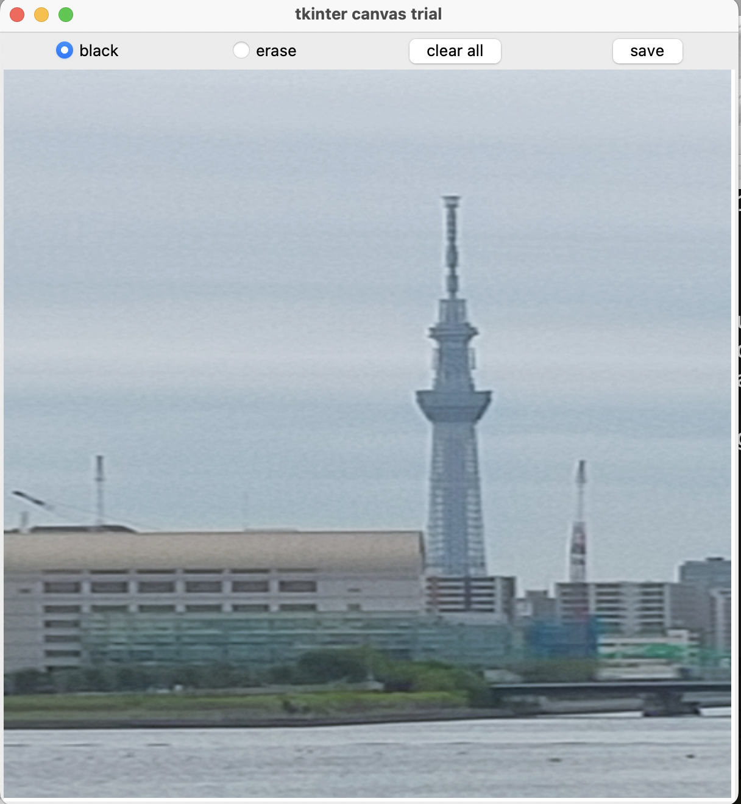
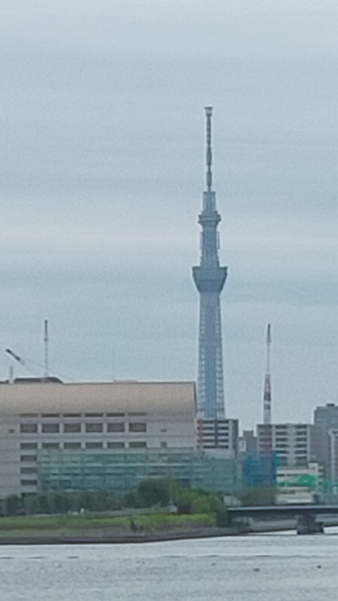
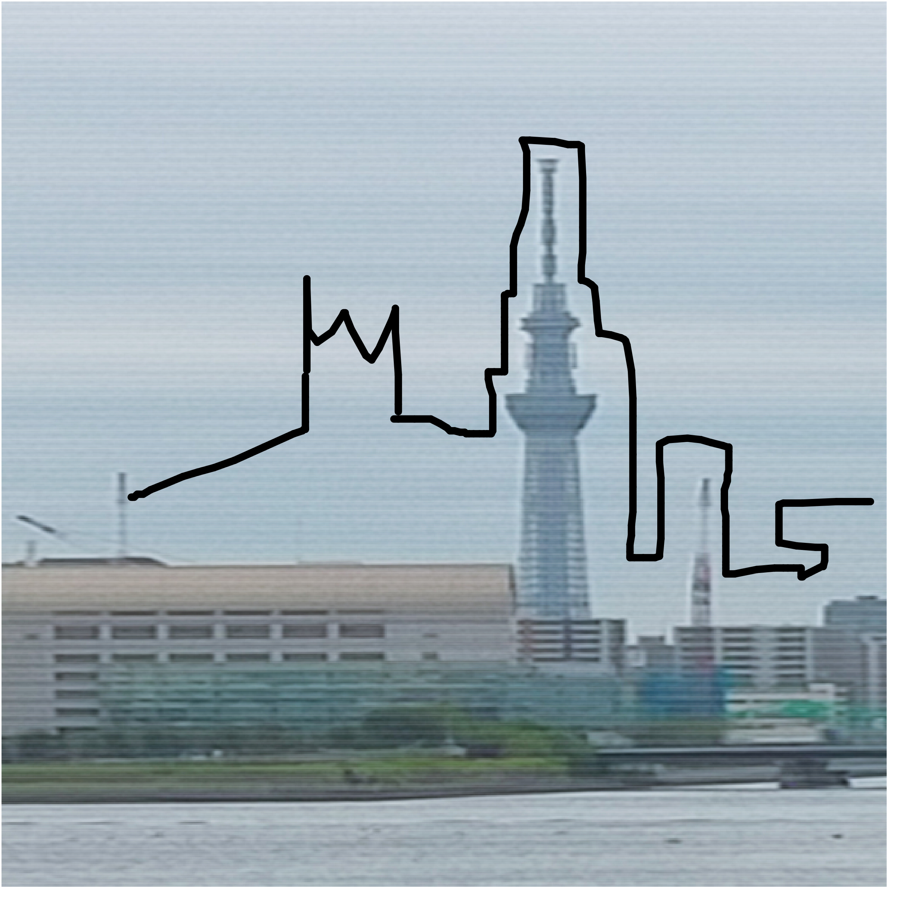

# drow_onimage
You can draw on any image using tkinter and PIL. The drawn image is saved in that folder as a ps file, and you can download the drawn image by converting it at https://convertio.co/ja/ps-jpg/.

# How to install
`$ pip install drow_onimage`

# Packages required to run drow_onimage
`$ brew install tcl-tk`

`$ pip install opencv-python`

# How to use
`$ drow_onimage`

Enter any image including the extension

`$ Please enter the file up to the extension: filename`

The input image can now be used as a drawing.

You can write by selecting black.

If you select erase, it becomes an eraser.

If you select clear all, all the lines you have drawn so far will be erased.

Press the save button and it will be saved as a ps file.

If you want to quit drawing, press the ❌ button on the top right.

# Result of running drow_onimage

Convert the saved ps file to an image at https://convertio.co/ja/ps-jpg/

